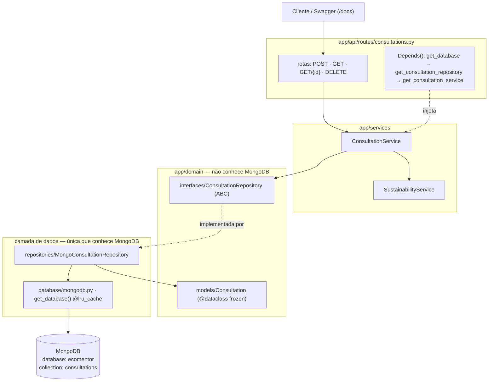
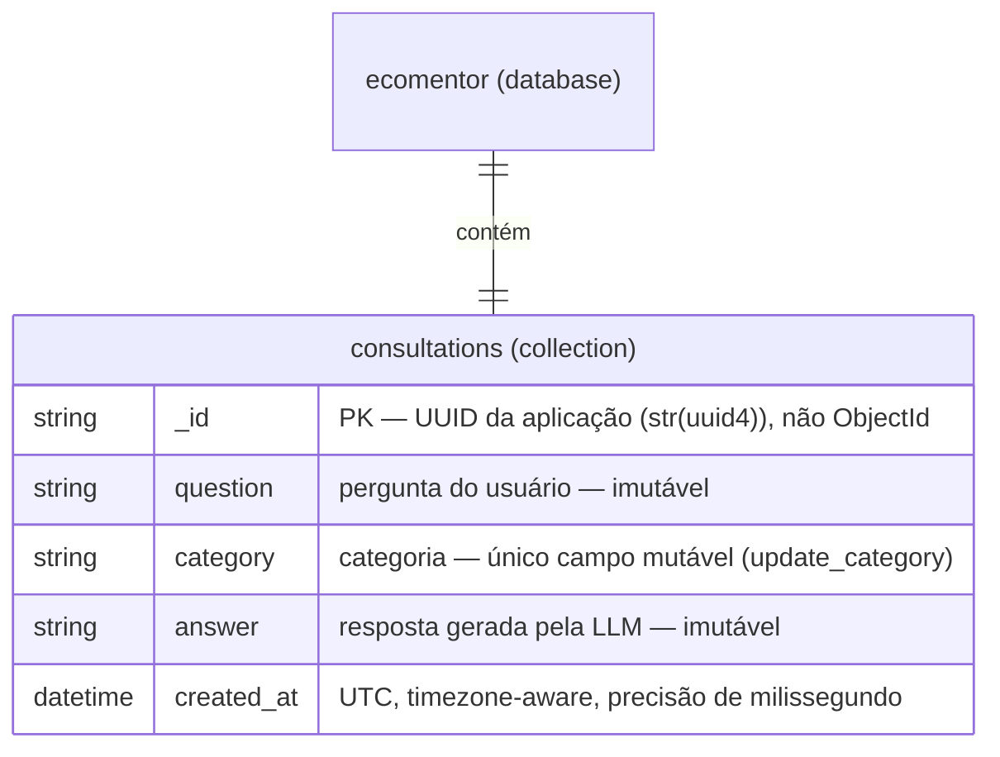
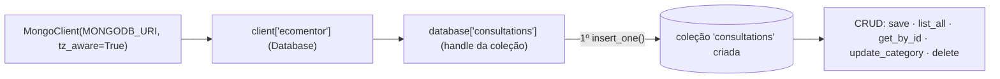

# MongoDB no EcoMentor

Documentação da camada de dados do backend: o que foi implementado e por que cada decisão foi tomada. Organizado por tópico.

## 1. Visão geral

O backend usa MongoDB como único banco de dados, com uma única coleção, `consultations`, onde cada documento representa uma consulta de sustentabilidade já respondida (pergunta, categoria, resposta e data).

Arquitetura em camadas, de fora para dentro:

```
app/api/routes/          -> endpoints FastAPI
app/services/            -> regra de negócio
app/domain/interfaces/   -> contratos abstratos (não sabem que MongoDB existe)
app/domain/models/       -> entidade Consultation
app/repositories/        -> implementação concreta sobre MongoDB
app/database/            -> conexão com o MongoDB
```



O domínio (`app/domain/`) não importa nada de `pymongo`. Só a camada de `repositories/` e `database/` sabe que o banco é MongoDB, isso permite trocar de banco no futuro sem tocar em regra de negócio, e permite testar a regra de negócio sem precisar de um banco de verdade.

## 2. Modelagem do documento

Arquivo: `app/domain/models/consultation.py`.

Estrutura do documento na coleção `consultations`:

```json
{
  "_id": "uuid-gerado-pela-aplicacao",
  "question": "Posso jogar óleo de cozinha na pia?",
  "category": "residuos",
  "answer": "Não deve ser descartado na pia...",
  "created_at": "2026-08-30T12:00:00+00:00"
}
```



A coleção é criada de forma *lazy*: o MongoDB só a materializa no primeiro `insert_one`.



- **Coleção única**, documentos homogêneos (todos com os mesmos 5 campos, sempre preenchidos) — atende diretamente ao requisito da AEP para o 1º semestre.
- `Consultation` é uma `@dataclass(frozen=True)` do Python puro (não Pydantic). Motivo: manter o modelo de domínio isolado de qualquer biblioteca de infraestrutura — os schemas HTTP do FastAPI (esses sim Pydantic) ficam restritos à borda da API, não ao domínio.
- `frozen=True` (imutável) e `answer` obrigatório: uma `Consultation` só é criada depois que a LLM já respondeu, então nunca existe um registro "pela metade" no banco. Isso é reforçado pela própria ordem dos campos na dataclass — `question`, `category`, `answer` são obrigatórios; `id` e `created_at` têm valor default.

## 3. Identidade dos documentos (`_id`)

- O campo `_id` do Mongo recebe o mesmo `id` gerado pela entidade de domínio (`str(uuid4())`), em vez de deixar o MongoDB gerar um `ObjectId`.
- Motivo: o MongoDB aceita qualquer valor único como `_id` (não precisa ser `ObjectId`) — usar o id que o domínio já gera evita ter dois identificadores diferentes para o mesmo registro, e evita importar `bson.ObjectId` dentro da camada de domínio ou de serviço.
- `created_at` é sempre gerado como `datetime` **timezone-aware** (`datetime.now(timezone.utc).replace(microsecond=0)`), nunca naive — MongoDB/BSON armazena datas em UTC e só com precisão de milissegundo; truncar o microssegundo na origem mantém o round-trip `save`/`get_by_id` idempotente e evita bugs sutis de comparação/ordenação.

## 4. Driver e conexão

Arquivo: `app/database/mongodb.py`.

- Driver escolhido: **PyMongo síncrono** (`pymongo.MongoClient`), não o driver assíncrono (Motor).
- Motivo: a interface `ConsultationRepository` foi definida com métodos síncronos. A própria documentação oficial do FastAPI recomenda usar `def` normal (não `async def`) quando não há necessidade clara de assincronia — rotas síncronas rodam automaticamente numa threadpool, sem travar o event loop. Para o tamanho desta PoC, isso é suficiente e evita complexidade desproporcional.
- `get_database()` é um singleton via `@lru_cache` — o mesmo idioma já usado em `core/config.py:get_settings()`, para manter o projeto consistente consigo mesmo. `MongoClient` do PyMongo já gerencia seu próprio pool de conexões internamente, então não é preciso nenhum hook de `startup`/`shutdown` no FastAPI para abrir/fechar conexão.
- O client é criado com `tz_aware=True`: por padrão o PyMongo devolve datas do Mongo como `datetime` naive mesmo o BSON guardando em UTC — sem essa flag, o `created_at` lido de volta do banco perderia a característica timezone-aware definida na modelagem.
- `serverSelectionTimeoutMS=5000`: sem isso o default é 30 s — um MongoDB fora do ar faria qualquer request (inclusive `GET /health`) travar 30 s antes de virar `RepositoryError`/503.

O endpoint `GET /health` faz `client.admin.command("ping")`: responde `{"status": "ok"}` com o banco acessível, ou **503** se o `ping` levantar `PyMongoError`.

## 5. Operações implementadas (CRUD completo)

Arquivo: `app/repositories/mongo_consultation_repository.py`, implementando a interface `app/domain/interfaces/consultation_repository.py`.

- **Create** — `save(consultation)`: `insert_one` com o documento já montado a partir da entidade.
- **Read** — `list_all()`: retorna todos os documentos ordenados por `created_at` decrescente (mais recente primeiro); `get_by_id(consultation_id)`: busca por `_id`, retorna `None` se não existir (em vez de lançar exceção — a decisão de responder 404 fica pra camada de rota, que entende HTTP, não pro repository).
- **Update** — `update_category(consultation_id, category)`: usa `find_one_and_update` com `return_document=ReturnDocument.AFTER`, atômico (busca e atualiza numa única ida ao banco, evitando race condition entre um update e uma leitura separados). Só o campo `category` pode ser atualizado — `question` e `answer` continuam imutáveis, porque representam um fato histórico (o que foi perguntado e o que a LLM respondeu naquele momento). "Atualizar" uma entidade imutável, na prática, significa gerar uma nova instância (`dataclasses.replace`), não mutar em memória.
- **Delete** — `delete(consultation_id)`: `delete_one`, retorna `True`/`False` conforme algo tenha sido removido ou não.
- Mapeamento entre documento (dict) e entidade (`Consultation`) é feito manualmente (`_to_document`/`_to_entity`), sem biblioteca de ODM — o modelo tem só 5 campos, então uma dependência extra de mapeamento objeto-documento adicionaria complexidade sem benefício proporcional.
- **Tratamento de erro:** o decorator `_translate_errors` envolve as 5 operações e converte qualquer `PyMongoError` (Mongo fora do ar, timeout, etc.) em `RepositoryError` (`app/domain/exceptions.py`), erro de domínio. A camada de rota captura `RepositoryError` e responde **HTTP 503**. Erros de "não encontrado" continuam sinalizados por retorno (`None`/`False`), não por exceção — a decisão de responder 404 fica na rota.

## 6. Estratégia de testes

- **Testes unitários** (`tests/unit/test_mongo_consultation_repository.py`): usam `mongomock`, uma biblioteca que simula a API do PyMongo em memória, sem precisar de um MongoDB de verdade rodando. Cobrem todas as operações (save, list ordenado, get encontrado/não encontrado, delete encontrado/não encontrado, update encontrado/não encontrado).
- **Testes de integração** (`tests/integration/test_mongodb.py`): rodam contra um MongoDB real, configurado pela mesma `MONGODB_URI` da aplicação, mas usando um banco **separado** (`ecomentor_test`) — nunca o banco de desenvolvimento — e limpando a coleção depois de cada teste.
- Se não houver MongoDB acessível localmente, os testes de integração são pulados automaticamente (`pytest.mark.skipif`), em vez de falhar a suíte inteira. No **CI** (`.github/workflows/tests.yml`) sobe um serviço `mongo:7`, então lá esses 4 testes executam de verdade (38 passed / 0 skipped).
- Essa separação (unit rápido e determinístico via mock + integração opcional contra o banco real) segue o princípio da pirâmide de testes: muitos testes rápidos na base, poucos testes mais lentos confirmando a integração real.

## 7. Decisões de escopo — o que foi deixado de fora, de propósito

- **Uma única coleção.** Multiplas coleções, relacionamento entre coleções e documentos aninhados/subdocumentos são explicitamente escopo da 2ª entrega da AEP, não desta.
- **Índices** (criados no `__init__` do repositório, idempotentes): `created_at:-1` (ordenação da listagem) e o composto `category:1, created_at:-1` (filtro por categoria + ordenação da rota `GET /consultations?category=`). Além do `_id` automático.
- **Sem ODM** (Beanie, MongoEngine etc.) — mapeamento manual é suficiente e mais simples de entender/depurar para 5 campos.
- **Sem Motor/async** — ver seção 4.


