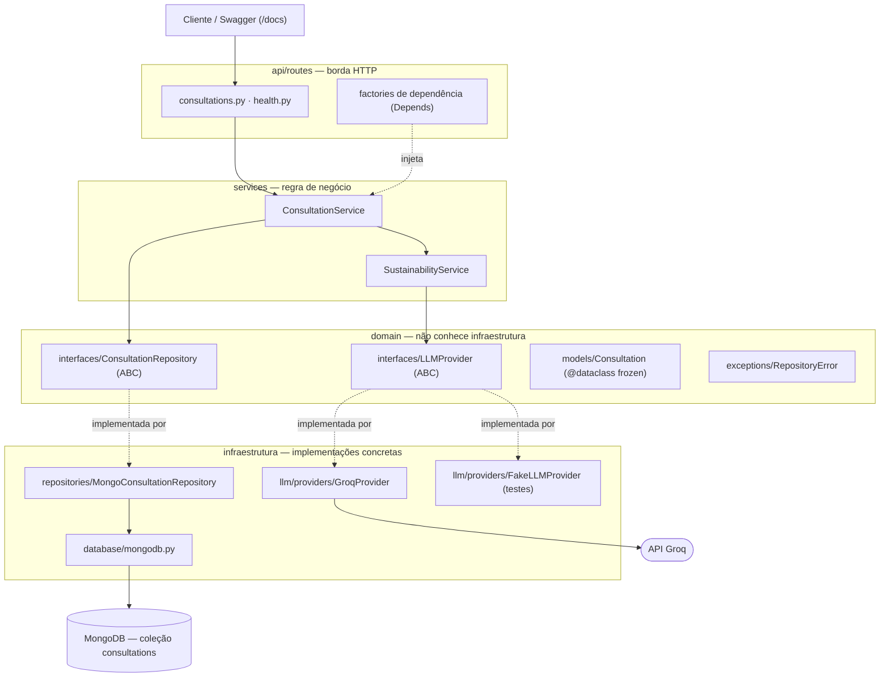

# Arquitetura do backend

## Camadas

## Regra de dependência

`api/routes` → `services` → **interfaces** do `domain`. Serviços dependem só de
`ConsultationRepository` e `LLMProvider` (abstratos) — nunca de `pymongo`,
`langchain_groq` ou classes concretas. O `domain` não importa nada de infraestrutura.
O wiring concreto (Groq, MongoDB) existe apenas no *composition root*:
`api/routes/consultations.py`, via `Depends`.

Isso é o que sustenta o critério de POO/abstração da rubrica e permite testar a
regra de negócio sem banco nem chave de API.

## Fluxo de um `POST /consultations`

1. `create_consultation` recebe `{question, category}`.
2. `ConsultationService.create_consultation` chama `SustainabilityService.generate_guidance`,
   que monta o prompt e chama `LLMProvider.generate_response` (Groq em produção).
3. Com a resposta, cria uma `Consultation` (imutável) e chama `ConsultationRepository.save`.
4. `MongoConsultationRepository` grava na coleção `consultations` e devolve a entidade.
5. A rota serializa via `ConsultationResponse` → HTTP 201.

## Tratamento de erro

| Origem | Camada que trata | Resposta |
|---|---|---|
| Falha da LLM (`invoke` ou construção do client) | `GroqProvider` → `RuntimeError` → rota | 502 |
| MongoDB indisponível / `PyMongoError` | `MongoConsultationRepository` → `RepositoryError` → rota | 503 |
| MongoDB indisponível no `GET /health` | `health_check` faz `ping` e captura `PyMongoError` | 503 |
| Recurso inexistente | rota (`None` do repositório) | 404 |

`MongoConsultationRepository` converte qualquer `PyMongoError` em `RepositoryError`
(erro de domínio) através do decorator `_translate_errors`; a borda HTTP traduz isso
em status code.

## Decisões

- **PyMongo síncrono** (não Motor): a interface do repositório é síncrona e o FastAPI
  roda rotas `def` em threadpool. Simplicidade proporcional à PoC.
- **Sem ODM**: mapeamento manual `_to_document`/`_to_entity` para 5 campos.
- **`Consultation` imutável** (`frozen=True`): só existe após a LLM responder; "atualizar"
  gera nova instância (`dataclasses.replace`).
- **`_id` = UUID da aplicação**, não `ObjectId` — um identificador só para o registro.
- **Coleção única `consultations`** — escopo travado da 1ª entrega. Múltiplas coleções,
  relacionamentos e subdocumentos são da 2ª entrega.
